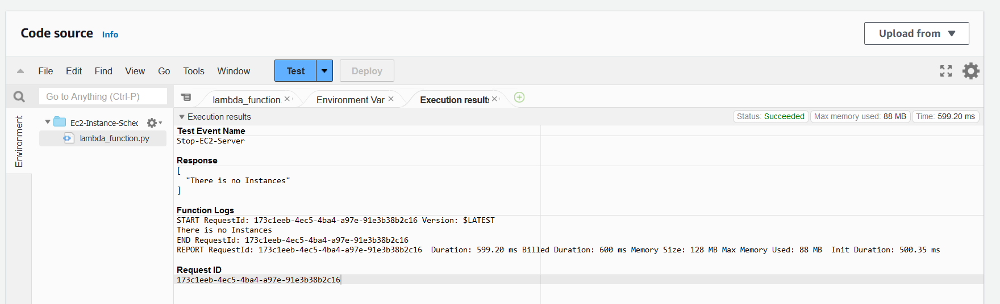

# Lab-How-To-Automate-AWS-Instance-Start-and-Stop-By-Using-Lambda-and-EventBridge

### Step 1 - Create IAM role for Lambda Function

- Go to AWS Console and type `IAM` and click this


- Click `Polices` and then `Create policy`


- Click `JSON` and copy the following json and then click `Next`


```
{
    "Version": "2012-10-17",
    "Statement": [
        {
            "Effect": "Allow",
            "Action": [
                "ec2:StartInstances",
                "ec2:StopInstances",
                "ec2:DescribeInstances"
            ],
            "Resource": "*"
        },
        {
            "Effect": "Allow",
            "Action": [
                "logs:CreateLogGroup"
            ],
            "Resource": "arn:aws:logs:*:*:*"
        },
        {
            "Effect": "Allow",
            "Action": [
                "logs:CreateLogStream",
                "logs:PutLogEvents"
            ],
            "Resource": "arn:aws:logs:*:*:log-group:/aws/lambda/Ec2Scheduler:*"
        }
    ]
}
```

- Write `Policy Name` and click `Create policy`


- Click `Roles` and click `Create role`


- Choose `lambda` and click `Next`


- Search policies like this and click `checkbox` then `Next`


- Write role name 


- Click create role


### Step 2 - Create Lambda Function

- Go to AWS Console and type `lambda` and click this


- Click `Create function`


- Write function name and choose `python` at runtime


- Select `Use an existing role` and choose `EC2-Instance-Scheduler-TKK` then click `Create function`


- Copy and paste the following code to `lambda_function.py` then click `Deploy`


```
import os
import boto3

ec2 = boto3.client('ec2')

def get_instances_by_tag(ScheduleGroup):
    instance_id_array = []
    filters = [{
        'Name': 'tag:ScheduleGroup',
        'Values': [ScheduleGroup]
    }]
    response = ec2.describe_instances(Filters=filters)
    for item in response["Reservations"]:
        for instance in item['Instances']:
            instance_id_array.append(instance['InstanceId'])
    return instance_id_array


def start(ids: list) -> list:
    res = []
    try:
        res = ec2.start_instances(InstanceIds=ids)
    except Exception as e:
        return [str(e)]
    return res.get('StartingInstances', '')

def stop(ids: list) -> list:
    res = []
    try:
        res = ec2.stop_instances(InstanceIds=ids)
    except Exception as e:
        return [str(e)]
    return res.get('StoppingInstances', '')

def lambda_handler(event, context):
    action = event.get('action', '')
    ScheduleGroup = event.get('ScheduleGroup', '')
    instances = get_instances_by_tag(ScheduleGroup)
    if (len(instances) < 1):
        res = 'There is no Instances'
        print(res)
        return [res]

    if action == 'stop':
        res = stop(instances)
    elif action == 'start':
        res = start(instances)
    else:
        pass

    print(res)
    return res
```


- Click `Test`


- Write `Event name` and fill the following code to `Event JSON`
then click `Save`
```
{
  "action": "stop",
  "ScheduleGroup": "EC2-Scheduler"
}
```


- Click `Test`


- You will see like this. It is correct and need to add tag in EC2.



- Go to AWS Console and type `EC2` and click this


- Select `checkbox` and click `Manage tags`


- Click `Add new tag` and fill tag information then click `Save`


- Click `Test`


- Now EC2 state is stopping


- To run EC2 again, click `Down Arrorw` and click `Configure test event`


- fill the following code to `Event JSON`
then click `Save`
```
{
  "action": "start",
  "ScheduleGroup": "EC2-Scheduler"
}
```


- Click `Test` and will see EC2 running again


### Step 3 - Configure Amazon EventBridge

- Click `Add trigger`


- Choose EventBridge(CloudWatch Events)

- Select `Create a new rule`

- Write `Rule name` and `Rule description`

- Select `Schedule expression`

- Copy and paste this then click 'Add`

```
cron(30 21 * * ? *)
```


> [!NOTE]
> I would like to explain cron expression. Here is the information. Cron Expression are based on UTC Time Zone so we need to change to Myanmar Time Zone.


> [!IMPORTANT]
> cron(30 21 * * ? *) means Every Day of UTC 21:30 so Every Day of MMT 04:00 will run this cron.

```
| Minutes | Hours | Day of month | Month | Day of week | Year | Meaning |
|---------|-------|--------------|-------|-------------|------|---------|
| 0       | 10    | *            | *     | ?           | *    | Run at 10:00 am (UTC+0) every day |
| 15      | 12    | *            | *     | ?           | *    | Run at 12:15 pm (UTC+0) every day |
| 0       | 18    | ?            | *     | MON-FRI     | *    | Run at 6:00 pm (UTC+0) every Monday through Friday |
| 0       | 8     | 1            | *     | ?           | *    | Run at 8:00 am (UTC+0) every 1st day of the month |
| 0/15    | *     | *            | *     | ?           | *    | Run every 15 minutes |
| 0/10    | *     | ?            | *     | MON-FRI     | *    | Run every 10 minutes Monday through Friday |
| 0/5     | 8-17  | ?            | *     | MON-FRI     | *    | Run every 5 minutes Monday through Friday between 8:00 am and 5:55 pm (UTC+0) |
| 0/30    | 20-2  | ?            | *     | MON-FRI     | *    | Run every 30 minutes Monday through Friday between 10:00 pm on the starting day to 2:00 am on the following day (UTC) |
| 0       | 0-2   | ?            | *     | MON         | *    | Run from 12:00 am to 2:00 am on Monday morning (UTC) |
```

- Click `Start-EC2-Server`


- Click `Targets` then click `Edit`


- Click `Drop Down Arrow` and choose `Constant (JSON text) then copy the following code to here


```
{
  "action": "start",
  "ScheduleGroup": "EC2-Scheduler"
}
```


- Click `Next`


- Click `Next`


- Click `Update rule`


- Click `Add trigger`


- Choose EventBridge(CloudWatch Events)

- Select `Create a new rule`

- Write `Rule name` and `Rule description`

- Select `Schedule expression`

- Copy and paste this then click 'Add`

```
cron(30 12 * * ? *)
```


> [!IMPORTANT]
> cron(30 12 * * ? *) means Every Day of UTC 12:30 so Every Day of MMT 19:00 will run this cron.


- Click `Stop-EC2-Server`


- Click `Targets` then click `Edit`


- Click `Drop Down Arrow` and choose `Constant (JSON text) then copy the following code to here


```
{
  "action": "stop",
  "ScheduleGroup": "EC2-Scheduler"
}
```


- Click `Next`


- Click `Next`


- Click `Update rule`


- EC2 install will run every 4:00AM and stop every 7:00PM.

| Start Time | Stop Time | Start Time | Stop Time |
|------------|-----------|------------|-----------|
| 4:00 AM    | 7:00 PM   | cron(30 21 * * ? *) | cron(30 12 * * ? *) |

------
**_That's it! You have finished How To Automate AWS Instance Start and Stop By Using Lambda and EventBridge._**
-----
